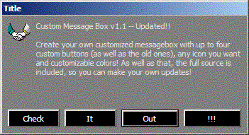



## Custom Message Box Class\! v1\.1 \[ UPDATED \]

### Description

Creates a totally customizable MsgBox replacement which can have custom icons and buttons. Report any bugs or suggestions, and feel free to modify the code (just give me credit for the original).

One thing I haven't gotten around to adding yet is the support for default buttons, so if you have to, you can add that.

Also, in order to use this in the sample prog (any prog for that matter), you have to compile it into a DLL and reference in the project first. PSC doesn't allow precompiled DLLs, so you have to do it.

[ UPDATED ] It now has full support for changing the colors of the buttons and messagebox, as well as their colors
 
### More Info
 

             |
---                |---
**Submitted On**   |2002-01-14 17:08:18
**By**             |[VolteFace](https://github.com/Planet-Source-Code/PSCIndex/blob/master/ByAuthor/volteface.md)
**Level**          |Intermediate
**User Rating**    |4.0 (8 globes from 2 users)
**Compatibility**  |VB 6\.0
**Category**       |[Custom Controls/ Forms/  Menus](https://github.com/Planet-Source-Code/PSCIndex/blob/master/ByCategory/custom-controls-forms-menus__1-4.md)
**World**          |[Visual Basic](https://github.com/Planet-Source-Code/PSCIndex/blob/master/ByWorld/visual-basic.md)
**Archive File**   |[Custom\_Mes490491162002\.zip](https://github.com/Planet-Source-Code/volteface-custom-message-box-class-v1-1-updated__1-30797/archive/master.zip)

